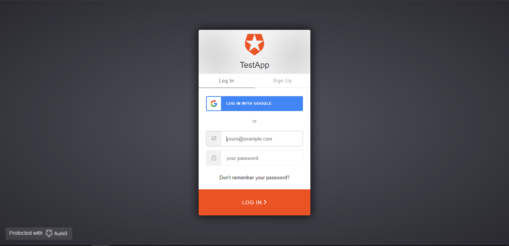
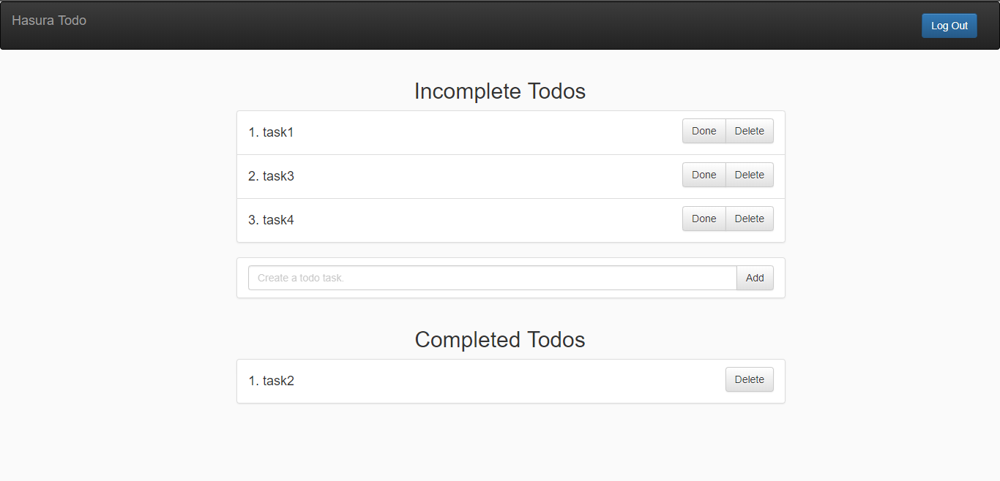
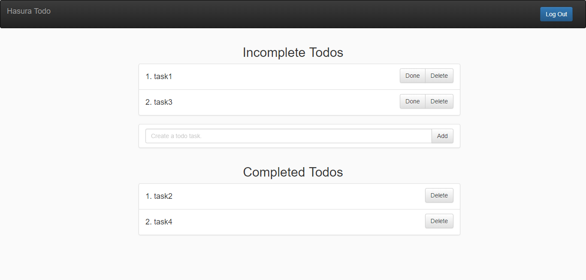

## React Hasura Todo App
This is a simple todo app built using react and hasura.

### How to run

1.  Clone this repo.
2.  Run `yarn install`
3.  Run `yarn start` 
4.  You can view the app at `http://localhost:3000`.

## Technologies Used

- React ([React-Boilerplate](https://github.com/react-boilerplate/react-boilerplate))
- Hasura
- Auth0

# Screenshots

## How to make?
Read this blog by [Anupam-dagar](https://github.com/Anupam-dagar) [Building a React Todo App with Hasura GraphQL Engine](https://hackernoon.com/building-a-react-todo-app-with-hasura-graphql-engine-511b703a7ef)